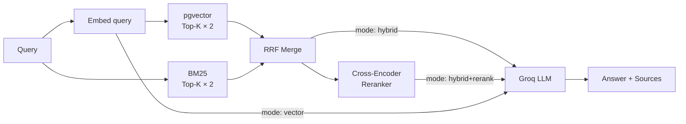

# 🔍 RAG Stack E2E

> End-to-end Retrieval-Augmented Generation pipeline with hybrid search, reranking, and automated evaluation.  
> Built to demonstrate production-grade LLM pipeline engineering: ingestion, retrieval, generation, and eval harness.

---

## ✨ What's Inside

| Component | Details |
|---|---|
| **Ingestion pipeline** | Load docs → chunk → embed → store in pgvector |
| **Deduplication** | SHA-256 content hash — same doc never indexed twice |
| **Hybrid search** | BM25 (sparse) + pgvector (dense) fused via RRF |
| **Reranking** | Cross-encoder (`ms-marco-MiniLM-L-6-v2`) as 2nd-stage filter |
| **Generation** | Groq `llama-3.3-70b-versatile` via OpenAI-compatible API |
| **Eval harness** | Q/A dataset → similarity + faithfulness + latency per mode |
| **Caching** | Embeddings cached in Postgres; incremental updates only |

---

## 📊 Eval Results

Evaluated on 8 Q/A pairs from an AI knowledge base:

| Mode | Similarity ↑ | Faithfulness ↑ | Latency ↓ |
|---|---|---|---|
| `vector` | **0.773** | **0.656** | **332ms** |
| `hybrid` | 0.724 | 0.607 | 277ms |
| `hybrid+rerank` | 0.721 | 0.608 | 3263ms |

**Key findings:**
- Pure vector search wins on a clean, focused corpus — BM25 doesn't help when vocabulary is consistent
- Reranker adds ~10× latency with marginal quality gain at small scale
- Q7 (exact numeric fact) scored low across all modes — factual precision requires structured retrieval
- At scale (10k+ docs, mixed vocabulary), hybrid + rerank typically outperforms vector-only

> Run your own eval: `python scripts/eval_run.py`

---

## 🏗️ Architecture

```
                    POST /ingest
                         │
              ┌──────────▼──────────┐
              │  Ingestion Pipeline  │
              │  chunk → embed       │
              │  dedup (SHA-256)     │
              └──────────┬──────────┘
                         │
              ┌──────────▼──────────┐
              │     PostgreSQL      │
              │  + pgvector ext.    │
              │  chunks + embeddings│
              └──────────┬──────────┘
                         │
         POST /ask        │
              ┌───────────▼──────────────────────────┐
              │           Retrieval Layer             │
              │                                      │
              │  ┌─────────────┐  ┌───────────────┐  │
              │  │ BM25 (sparse)│  │ pgvector(dense)│  │
              │  └──────┬──────┘  └───────┬───────┘  │
              │         └────────┬─────────┘          │
              │              RRF Merge                │
              │                 │                     │
              │         ┌───────▼───────┐             │
              │         │  Cross-Encoder │             │
              │         │   Reranker    │             │
              │         └───────┬───────┘             │
              └─────────────────┼─────────────────────┘
                                │
              ┌─────────────────▼─────────────────────┐
              │    Groq LLM — grounded generation      │
              └────────────────────────────────────────┘
```

---

## 🔄 Retrieval Modes



---

## 🚀 Quick Start

**Prerequisites:** Docker, Python 3.12+, Groq API key (free at [console.groq.com](https://console.groq.com))

```bash
# 1. Clone
git clone https://github.com/GlebCeo/rag-stack-e2e
cd rag-stack-e2e

# 2. Configure
cp .env.example .env
# → Add your GROQ_API_KEY

# 3. Start Postgres with pgvector
docker-compose up db -d

# 4. Install dependencies
pip install -r requirements.txt

# 5. Start API
export $(cat .env | xargs)
uvicorn app.main:app --host 0.0.0.0 --port 8001 --reload

# 6. Ingest demo dataset
python scripts/ingest_demo.py

# 7. Ask a question
curl -X POST http://localhost:8001/ask \
  -H "Content-Type: application/json" \
  -d '{"question": "What is RAG?", "mode": "hybrid+rerank"}'

# 8. Run full evaluation
python scripts/eval_run.py
```

---

## 📋 API Reference

| Method | Endpoint | Description |
|---|---|---|
| `POST` | `/ingest` | Ingest a document (chunked + embedded) |
| `POST` | `/ask` | Query with RAG |
| `POST` | `/ingest/rebuild-index` | Rebuild BM25 in-memory index |
| `GET` | `/health` | Health check |

### POST `/ask`

```bash
curl -X POST http://localhost:8001/ask \
  -H "Content-Type: application/json" \
  -d '{
    "question": "How does BM25 differ from vector search?",
    "mode": "hybrid+rerank",
    "top_k": 5
  }'
```

```json
{
  "answer": "BM25 is based on TF-IDF and excels at exact keyword matching without GPU...",
  "sources": [
    { "id": "...", "content": "BM25 (Best Match 25)...", "score": 0.84 }
  ],
  "latency_ms": 3200.4,
  "mode": "hybrid+rerank"
}
```

**Modes:**
- `vector` — dense semantic search only (~330ms)
- `hybrid` — BM25 + vector fused with RRF (~280ms)
- `hybrid+rerank` — hybrid + cross-encoder reranking (~3200ms)

---

## 🔧 Chunking & Embedding

- **Chunker:** word-based sliding window, `CHUNK_SIZE=512`, `CHUNK_OVERLAP=64`
- **Embedding model:** `all-MiniLM-L6-v2` (384-dim, runs locally, no API cost)
- **Vector store:** PostgreSQL + `pgvector` extension, cosine distance

---

## 📁 Project Structure

```
rag-stack-e2e/
├── app/
│   ├── main.py            # FastAPI entrypoint
│   ├── config.py          # Settings (env vars)
│   ├── db/
│   │   ├── models.py      # Document, Chunk, EvalResult
│   │   └── session.py     # Async engine + init_db
│   ├── ingestion/
│   │   ├── chunker.py     # Sliding window chunker
│   │   ├── embedder.py    # sentence-transformers wrapper
│   │   └── pipeline.py    # Ingest + dedup logic
│   ├── search/
│   │   ├── vector.py      # pgvector cosine search
│   │   ├── bm25.py        # BM25Okapi in-memory index
│   │   ├── hybrid.py      # RRF merge
│   │   └── reranker.py    # Cross-encoder reranking
│   ├── api/
│   │   ├── ask.py         # POST /ask endpoint
│   │   └── ingest.py      # POST /ingest endpoint
│   └── eval/
│       ├── harness.py     # Eval runner across modes
│       └── metrics.py     # Similarity + faithfulness
├── data/
│   ├── documents.jsonl    # 8 AI knowledge base documents
│   └── eval_qa.jsonl      # 8 Q/A pairs for evaluation
├── scripts/
│   ├── ingest_demo.py     # Load demo dataset
│   └── eval_run.py        # Run eval → print table
├── docker-compose.yml
├── requirements.txt
└── .env.example
```

---

## 🛠️ Stack

| Layer | Technology |
|---|---|
| API | FastAPI + Uvicorn |
| Vector DB | PostgreSQL 15 + pgvector |
| Embeddings | `sentence-transformers/all-MiniLM-L6-v2` (local) |
| Sparse search | `rank-bm25` (BM25Okapi) |
| Reranker | `cross-encoder/ms-marco-MiniLM-L-6-v2` (local) |
| LLM | Groq `llama-3.3-70b-versatile` |
| Fusion | Reciprocal Rank Fusion (RRF) |

---

## ⚙️ Configuration

| Variable | Default | Description |
|---|---|---|
| `GROQ_API_KEY` | — | Groq API key |
| `LLM_MODEL` | `llama-3.3-70b-versatile` | Generation model |
| `EMBED_MODEL` | `all-MiniLM-L6-v2` | Embedding model |
| `CHUNK_SIZE` | `512` | Words per chunk |
| `CHUNK_OVERLAP` | `64` | Overlap between chunks |
| `TOP_K` | `5` | Retrieved chunks per query |
